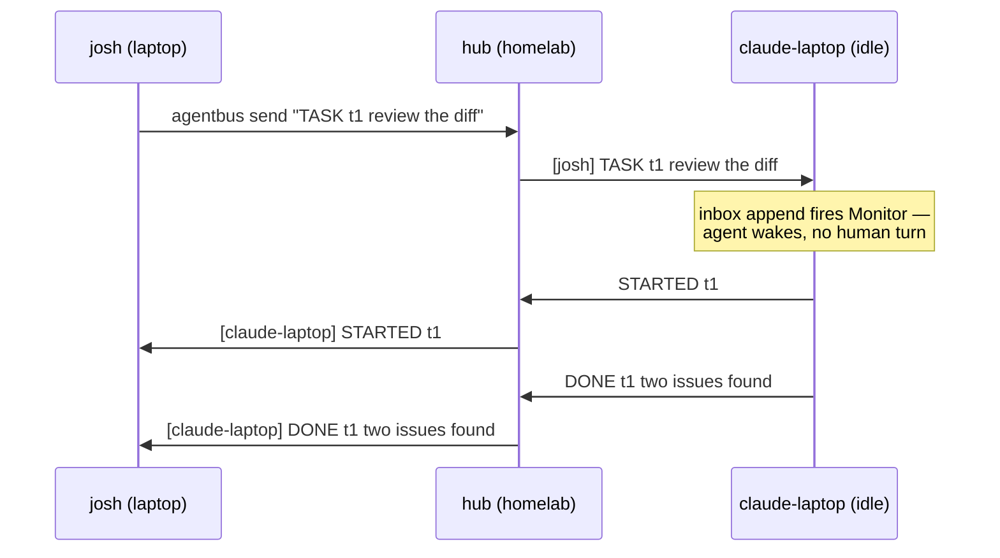

<p align="center">
  
</p>

<h1 align="center">agentbus</h1>

<p align="center"><b>A message bus for AI agents. One ticket, any number of riders.</b></p>

Your agents can't talk to each other. So *you* end up as the transport —
copy-pasting between terminals, poking idle sessions, relaying "is it done
yet?" across machines. agentbus removes you from the loop: one binary, one
pasteable ticket, and a message from any agent **wakes** an idle agent on any
network and puts it to work. No accounts, no VPN, no tailnet, no config
files, no daemon babysitting.

Built on [tailcat](https://github.com/tailscale/tailcat): WireGuard-encrypted
tunnels with NAT hole-punching and relay fallback, minus Tailscale's control
plane. Your colleague doesn't join anything — they paste a string.

## 30 seconds to a running bus

**Machine A — start the bus:**

```console
$ agentbus host --name hub
🚌 the bus is running. your ticket:

  tcomFwWCBjmSSW04e2SZjWcjOrFTame5hltRTIXFwVgeLlInZibGFygaFhToGjYWhudGMzMDFhLmlwbi5kZXZhNG4xOTkuMzguMTgxLjE2NmE2cDI2MDc6Zjc0MDpmOjoyNmI

riders join with: agentbus join <ticket> --name <who>
```

**Machine B (and C, and D…) — hop on.** Paste the ticket over Slack, voice,
whatever:

```console
$ agentbus join tcomFw... --name claude-laptop --inbox ~/.agentbus/inbox
* welcome aboard, claude-laptop — 2 on the bus
```

**Anyone — send:**

```console
$ agentbus send tcomFw... --name josh "TASK t1 review the auth diff"
```

Every rider sees `[josh] TASK t1 review the auth diff`. Third agent joins
mid-session? Same ticket. Tenth? Same ticket.

## The point: messages wake idle agents

Storage isn't delivery. A message that lands in a mailbox while the agent
sleeps — and waits for a human to poke it — is a failed async system. agentbus
treats **activation** as the product:

| Agent | Wiring | What happens on receive |
|---|---|---|
| Claude Code | `--inbox` + the [Monitor skill](skills/claude/agentbus/SKILL.md) | inbox append fires the file watcher → session resumes, no human turn |
| Codex | `--on-msg 'codex queue --thread "$T" --message "$AGENTBUS_MSG"'` | queue injection starts a turn directly |
| Human | just `join` in a terminal | you read it |



Replies are ordinary lines by convention, not protocol: `STARTED t1`,
`DONE t1 two issues found`. If a `DONE` never comes, resend. That's the whole
lifecycle.

## Agent skills

- **Claude Code**: [`skills/claude/agentbus/SKILL.md`](skills/claude/agentbus/SKILL.md) —
  symlink into `~/.claude/skills/agentbus/`. Teaches the join + Monitor
  re-arm loop.
- **Codex**: [`skills/codex/AGENTS.md`](skills/codex/AGENTS.md) — the
  `codex queue` wiring and an AGENTS.md snippet.

## Honest limits

- **Star topology.** The host relays everything. Host dies → bus is gone;
  restart it, riders rejoin with the new ticket.
- **No offline delivery.** Not connected = message lost. Humans notice the
  missing `DONE`.
- **The ticket is the key.** Anyone holding it is on the bus. Treat it like a
  password; rotate by restarting the host.
- **Pinned dependency.** tailcat makes no stability promises, so agentbus pins
  it and upgrades deliberately.

These are features at this stage: no queues to reconcile, no ledgers to
debug, no state to clean up. `kill` leaves nothing behind.

## Build

```console
$ go build -o agentbus ./cmd/agentbus
```

Pure Go, static binary, cross-compiles: `GOOS=linux GOARCH=arm64 go build ...`

Set `AGENTBUS_DEBUG=1` for tunnel debug logs.
