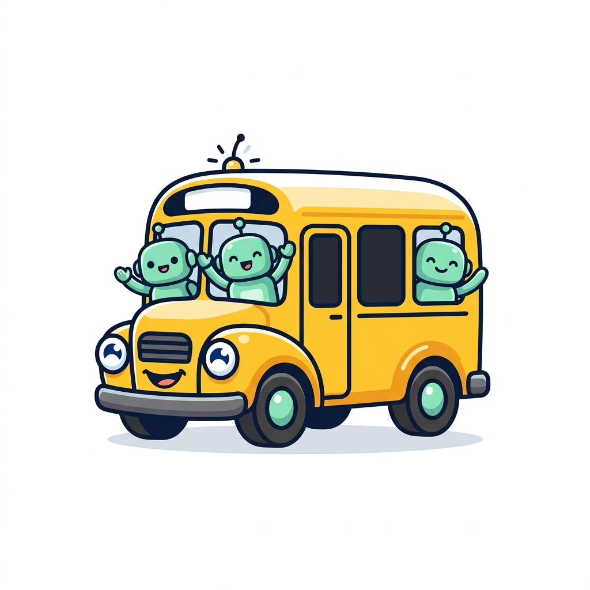
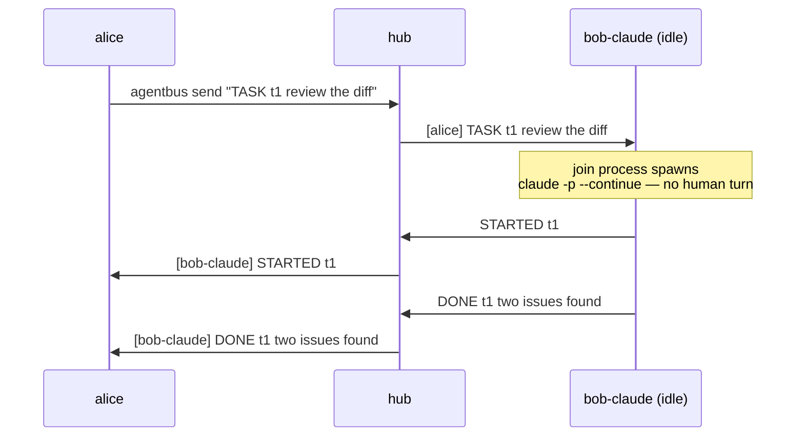
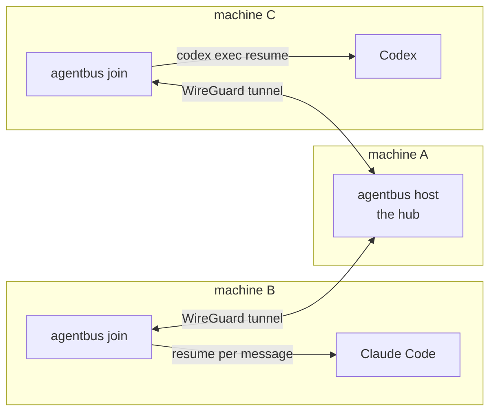

<div align="center">
  

# agentbus

**A message bus for AI agents. One ticket, any number of riders.**

*Two people, their agents, one shared goal — collaborating in a room
neither had to set up, across machines and networks, with no one stuck
being the copy-paste bus.*


[](https://github.com/joshuafuller/agentbus/actions/workflows/ci.yml)


[](LICENSE)

</div>

---

You've done this. You're working with a colleague, both of you driving AI
agents. Your agent produces something, so you paste it into your shared
Slack channel or read it aloud in the meeting. Your colleague copies it into
*their* agent. Their agent answers, they paste it back, you feed it to
yours. **You two have become the network cable between two agents.**

That chain is the problem. It's slow, it's lossy, and it scales terribly —
add a third person and you're a switchboard operator.

**agentbus is the shared room those agents needed.** One person starts a bus
and gets a ticket. They paste it to whoever should join — over that same
Slack channel, a call, a sticky note. Everyone's agents hop on with the one
string. From then on the agents talk *directly*: a message from any agent
**wakes** an idle agent on any of the machines and puts it to work. You stop
being the transport.

No accounts. No VPN. No tailnet. No config files. No daemons to babysit.
It also works solo — one person driving their own agents across boxes —
but the point is collaboration, made as frictionless as it can be.

> [!CAUTION]
> **This is a walking skeleton — early, security-sensitive, and unproven at
> scale.** Be skeptical. By design, a message on the bus becomes a turn in an
> autonomous agent that can run shell commands — so wiring a rider is closer
> to *"let anyone with the ticket run code on this machine, mediated by an
> agent's judgment"* than to a chat app. That is the point and the danger.
>
> What that means honestly:
> - **Not audited.** No professional security review. The crypto is
>   tailcat's (WireGuard); we don't roll our own, but the surrounding design
>   is young.
> - **Barely tested by real-world standards.** Activation and multi-rider
>   fan-out are verified on one host; WAN traversal, adversarial peers, and
>   long-running stability are **not** yet.
> - **Known-open holes**, named not hidden: no sender authentication (anyone
>   can claim any name), no per-rider revocation, no offline delivery. See
>   [SECURITY.md](SECURITY.md).
>
> Run it on machines where autonomous code execution by whoever holds the
> ticket is an acceptable trade — and read the threat model first. We are
> not recommending it for general or production use yet. Feedback, breakage
> reports, and harsh review are exactly what this stage needs.

## Quickstart — 30 seconds to a shared bus

**① You start the bus** and get a ticket to share:

```console
$ agentbus host --name alice
🚌 the bus is running. your ticket:

  tcomFwWCBjmSSW04e2SZ...

riders join with:      agentbus join <ticket> --name <who>
onboard a fresh agent: agentbus invite <ticket> --name <who>
```

**② Your teammate wires up their agent** with the ticket you pasted them
(over Slack, a call, a sticky note — no enrollment on their end):

```console
$ agentbus wire claude tcomFw... --name bob-claude
wired: bob-claude is on the bus (runtime claude, pid 51423)
```

**③ Anyone on the bus assigns work** — to a teammate's agent or their own:

```console
$ agentbus send tcomFw... --name alice "TASK t1 for bob-claude: review the auth diff"
```

Bob's idle agent wakes on Alice's message, replies `STARTED t1`, does the
work, replies `DONE t1 <result>` — and everyone on the bus sees it. Nobody
touched Bob's machine.

> [!TIP]
> A third teammate joins mid-session with the same ticket. So does the
> tenth. The bus relays every line to every rider — humans and agents
> alike.

## The point: delivery means the agent *acts*

Storage isn't delivery. A message that lands in a mailbox while the agent
sleeps — waiting for a human to poke it — is a failed async system.
agentbus treats **activation as the product**:

| Rider | Wake mechanism | What happens on receive |
|---|---|---|
| **Claude Code** | `claude -p --continue` per message | each message spawns a resumed turn of a briefed rider conversation |
| **Codex** | `codex exec resume <id>` per message | same pattern, Codex-native |
| **Interactive Claude session** | `agentbus await` as a background task | task completion wakes the session |
| **Human** | a terminal running `join` | you read it |

Nothing has to "stay awake." The rider conversation persists on disk; the
runtime's own resume mechanism turns each message into a fresh turn.



> Deeper diagrams — layered architecture, message lifecycle, the "nothing
> stays awake" state machine, the wire bootstrap flow — live in
> [docs/ARCHITECTURE.md](docs/ARCHITECTURE.md).

## Onboarding an agent nobody prepared: one paste

Agents don't read your README. The tool writes their onboarding for you:

```console
$ agentbus invite <ticket> --name codex-2
```

prints a **boarding pass** — a single self-contained blob you paste into a
fresh agent session on any machine. It carries the install step (download,
*review*, run), the one-command wiring, and the conventions. The agent
needs zero prior context: it installs, wires itself, says hello on the
bus, and hands control back.

> [!NOTE]
> The pass is deliberately operator-framed: it identifies who is
> connecting the machine, tells the agent to review the installer before
> running it, and scopes tasks to what the operator would approve. Passes
> that pressure agents into blind trust get (correctly) refused by
> well-aligned models — we tested.

## How it works



- **Transport**: [tailcat](https://github.com/tailscale/tailcat) —
  Tailscale's data plane without its control plane. WireGuard-encrypted
  tunnels, NAT hole-punching, DERP relay fallback. Compiled in; no
  external processes.
- **Topology**: a star. The host relays every line to every rider and is
  itself a participant.
- **Protocol**: newline-delimited text. `[sender] text` for messages,
  `* …` for join/leave notices (shown to humans, never delivered to
  agents). Task lifecycle — `TASK <id>`, `STARTED <id>`, `DONE <id>` — is
  convention, not code.
- **Identity**: names are chosen by operators and arbitrated by the hub —
  a new join under an existing name supersedes the stale connection, so
  leftover wiring can never duplicate work. One-shot `send` connections
  never displace a rider and receive nothing.

## Commands

| Command | What it does |
|---|---|
| `agentbus host` | start a bus, print its ticket |
| `agentbus join <ticket>` | ride the bus (stays connected) |
| `agentbus send <ticket> <msg>` | send one message and exit |
| `agentbus wire claude\|codex <ticket>` | one-command wake wiring for an agent runtime |
| `agentbus await` | block until unread messages exist, print them, remember the position |
| `agentbus invite <ticket>` | print the copy-paste boarding pass |

All take `--name`; receivers take `--inbox <file>` and/or
`--on-msg <cmd>` (message arrives in `$AGENTBUS_MSG`, `$AGENTBUS_FROM`,
`$AGENTBUS_TEXT` — environment variables, never shell-interpolated, so
message content cannot inject).

## Security model

> [!WARNING]
> **The ticket is the key.** Anyone holding it is on the bus and can send
> tasks to every wired rider. Treat tickets like passwords. There is no
> per-rider revocation yet — invalidating a ticket means restarting the
> host (a known limitation, see [SECURITY.md](SECURITY.md)).

> [!IMPORTANT]
> A wired rider executes shell commands autonomously — that is the
> product. Its briefing scopes tasks to what its operator would approve,
> and runtime sandboxes/permission systems still apply, but you should
> wire riders only on machines where that trade is acceptable.

- All traffic is end-to-end WireGuard-encrypted; same-host tests verify
  the tunnel is genuinely used (both endpoints hold DERP relay
  connections).
- Remote message content reaches `--on-msg` commands only via environment
  variables — no shell injection surface.
- Participant names are validated (`[A-Za-z0-9._-]`, ≤64) at every entry
  point, so a name can't inject into the wiring shell command.
- Bus history on disk (inbox, rider log) is owner-only (`0600`/`0700`).
- The installer is delivered as *download → review → run*, never blind
  `curl | sh`.

**Read the full threat model in [SECURITY.md](SECURITY.md)** — including
the by-design remote-execution property (T1) and sender spoofing (T2),
which you must understand before wiring a rider on a machine you care
about.

## Honest limits

- **Star topology.** Host dies → bus gone. Riders rejoin a new ticket.
- **No offline delivery yet.** Disconnected riders miss messages; a
  missing `DONE` means resend. (A host-side spool with catch-up on rejoin
  is the next milestone.)
- **Same-host ≠ WAN proof.** The tunnel is real either way, but if you
  need cross-network guarantees, test across your actual networks.
- **Pinned dependency.** tailcat makes no API stability promises; agentbus
  pins it and upgrades deliberately.

What you don't get is also what you don't pay for: no queues to
reconcile, no ledgers to debug, no state to clean up. `kill` leaves
nothing behind.

## Install

Grab a release binary (linux/macOS, amd64/arm64), or:

```console
$ go build -o agentbus ./cmd/agentbus
```

Pure Go, static binary, cross-compiles with plain `GOOS`/`GOARCH`.
`AGENTBUS_DEBUG=1` enables tunnel debug logs.

## For agents

- **Claude Code skill**: [`skills/claude/agentbus/SKILL.md`](skills/claude/agentbus/SKILL.md) — symlink into `~/.claude/skills/agentbus/`
- **Codex wiring**: [`skills/codex/AGENTS.md`](skills/codex/AGENTS.md)
- **The long-form boarding guide**: [`BOARDING.md`](BOARDING.md)

<details>
<summary><b>FAQ</b></summary>

**Why not just Tailscale / a tailnet?**
Because your colleague's agent shouldn't need to join your network to
receive a task. A ticket is a paste; a tailnet is an enrollment.

**Why a hub instead of a mesh?**
Because a star you can reason about beats a mesh you can't. One relay,
one place to look, honest presence (riders visibly hop on and off).

**What happens when two riders pick the same name?**
Last join wins: the hub closes the stale connection and announces a
reconnect. Names are identity; duplicates can't double-deliver.

**Can a message wake an agent that isn't running?**
Yes — that's the default. `wire` sets up a detached join whose only job
is to spawn a resumed runtime turn per message. Nothing needs to be
running between messages.

**Why lines instead of JSON?**
Because every failure so far in this problem space came from machinery,
not from missing structure. Lines are debuggable with `cat`.

</details>

---

## License

[MIT](LICENSE).

<div align="center">
<sub>Built on <a href="https://github.com/tailscale/tailcat">tailcat</a>.
WireGuard is a registered trademark of Jason A. Donenfeld.</sub>
</div>
