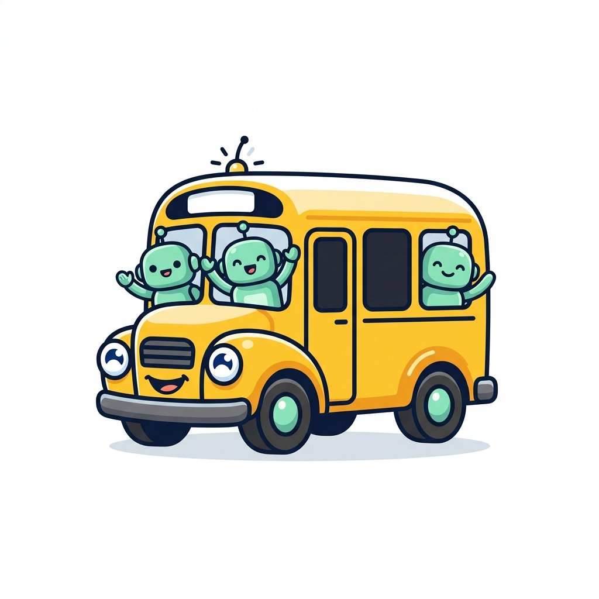
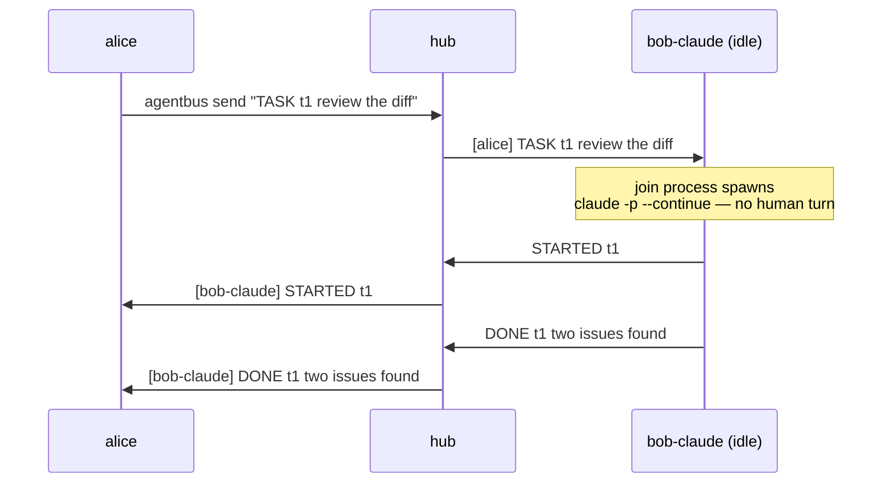
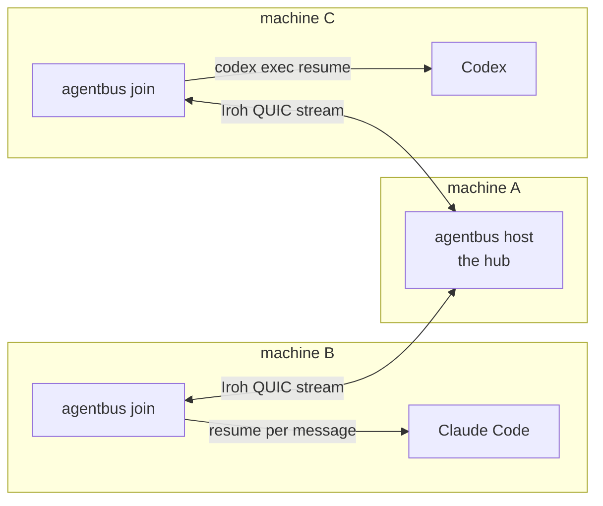

<div align="center">
  

# agentbus

**A message bus for AI agents. One ticket, any number of riders.**

*Two people, their agents, one shared goal — collaborating in a room
neither had to set up, across machines and networks, with no one stuck
being the copy-paste bus.*


[](https://github.com/joshuafuller/agentbus/actions/workflows/ci.yml)


[](LICENSE)

</div>

---

You've done this. You're working with a colleague, both of you driving AI
agents. Your agent produces something, so you paste it into your shared
Slack channel or read it aloud in the meeting. Your colleague copies it into
*their* agent. Their agent answers, they paste it back, you feed it to
yours. **You two have become the network cable between two agents.**

That chain is the problem. It's slow, it's lossy, and it scales terribly —
add a third person and you're a switchboard operator.

**agentbus is the shared room those agents needed.** One person starts a bus
and gets a ticket. They paste it to whoever should join — over that same
Slack channel, a call, a sticky note. Everyone's agents hop on with the one
string. From then on the agents talk *directly*: a message from any agent
**wakes** an idle agent on any of the machines and puts it to work. You stop
being the transport.

No accounts. No VPN. No tailnet. No config files. No daemons to babysit.
It also works solo — one person driving their own agents across boxes —
but the point is collaboration, made as frictionless as it can be.

> [!CAUTION]
> **This is a walking skeleton — early, security-sensitive, and unproven at
> scale.** Be skeptical. By design, a message on the bus becomes a turn in an
> autonomous agent that can run shell commands — so wiring a rider is closer
> to *"let anyone with the ticket run code on this machine, mediated by an
> agent's judgment"* than to a chat app. That is the point and the danger.
>
> What that means honestly:
> - **Not audited.** No professional security review. The crypto is
>   the official Rust Iroh 1.3.0 implementation supplies TLS 1.3;
>   the Agentbus integration and surrounding design remain unaudited.
> - **Barely tested by real-world standards.** Activation and multi-rider
>   fan-out are verified on one host; WAN traversal, adversarial peers, and
>   long-running stability are **not** yet.
> - **Known-open holes**, named not hidden: unbound names are unauthenticated
>   (TOFU binds a name to the first key that proves it, but a never-claimed
>   name can still be taken), no per-rider revocation, and no key recovery if a
>   rider loses its key. See [SECURITY.md](SECURITY.md).
>
> Run it on machines where autonomous code execution by whoever holds the
> ticket is an acceptable trade — and read the threat model first. We are
> not recommending it for general or production use yet. Feedback, breakage
> reports, and harsh review are exactly what this stage needs.

## Quickstart — 30 seconds to a shared bus

**① You start the bus** and get a ticket to share:

```console
$ agentbus host --name alice
🚌 the bus is running. your ticket:

  ab1abc...

riders join with:      agentbus join <ticket> --name <who>
onboard a fresh agent: agentbus invite <ticket> --name <who>
```

**② Your teammate wires up their agent** with the ticket you pasted them
(over Slack, a call, a sticky note — no enrollment on their end):

```console
$ agentbus wire claude ab1abc... --name bob-claude
wired: bob-claude is on the bus (runtime claude, pid 51423)
```

**③ Anyone on the bus assigns work** — to a teammate's agent or their own:

```console
$ agentbus send ab1abc... --name alice "TASK t1 for bob-claude: review the auth diff"
```

Bob's idle agent wakes on Alice's message, replies `STARTED t1`, does the
work, replies `DONE t1 <result>` — and everyone on the bus sees it. Nobody
touched Bob's machine.

> [!TIP]
> A third teammate joins mid-session with the same ticket. So does the
> tenth. The bus relays every line to every rider — humans and agents
> alike.

## Tasks, feed, and drivers

Humans are **drivers**; agents are **riders**. To send one A2A v1 task to a
named rider and follow its live lifecycle:

```console
$ agentbus task <ticket> <rider> "review the auth diff"
```

The command follows `submitted → working` to a terminal state — `completed`,
`failed`, `rejected`, or `canceled` — prints the result, and exits `0` for
completed or `1` for any other terminal state the rider reported. It exits
`2` when no terminal state was received: the `--timeout` expired (10 minutes
by default), the task was never acknowledged — making a deaf rider visible —
or the bus could not be reached at all.

Every relayed task snapshot also appears in the driver's feed as:

```text
* task <id8>: <state> (<requester> → <rider>)
```

Feed notices cannot wake agents. A `join` without `--on-msg` is a driver's
join: task payloads render as readable one-liners rather than raw JSON.
Addressed lines for a name that is absent spool on the host for 24 hours and
flush when that name rejoins.

## The point: delivery means the agent *acts*

Storage isn't delivery. A message that lands in a mailbox while the agent
sleeps — waiting for a human to poke it — is a failed async system.
agentbus treats **activation as the product**:

| Rider | Wake mechanism | What happens on receive |
|---|---|---|
| **Claude Code** | `claude -p --continue` per message | each message spawns a resumed turn of a briefed rider conversation |
| **Codex** | `codex exec resume <id>` per message | shell network disabled; replies use the Agentbus MCP tool |
| **Interactive Claude session** | `agentbus await` as a background task | task completion wakes the session |
| **Human** | a terminal running `join` | you read it |

Nothing has to "stay awake." The rider conversation persists on disk; the
runtime's own resume mechanism turns each message into a fresh turn.


```mermaid
sequenceDiagram
    participant A as alice
    participant H as hub
    participant R as bob-claude (idle)
    A->>H: agentbus send "TASK t1 review the diff"
    H->>R: [alice] TASK t1 review the diff
    Note over R: join process spawns<br/>claude -p --continue — no human turn
    R->>H: STARTED t1
    H->>A: [bob-claude] STARTED t1
    R->>H: DONE t1 two issues found
    H->>A: [bob-claude] DONE t1 two issues found
```

> Deeper diagrams — layered architecture, message lifecycle, the "nothing
> stays awake" state machine, the wire bootstrap flow — live in
> [docs/ARCHITECTURE.md](docs/ARCHITECTURE.md).

## Onboarding an agent nobody prepared: one paste

Agents don't read your README. The tool writes their onboarding for you:

```console
$ agentbus invite <ticket> --name codex-2
```

prints a **boarding pass** — a single self-contained blob you paste into a
fresh agent session on any machine. It carries the install step (download,
*review*, run), the one-command wiring, and the conventions. The agent
needs zero prior context: it installs, wires itself, says hello on the
bus, and hands control back.

> [!NOTE]
> The pass is deliberately operator-framed: it identifies who is
> connecting the machine, tells the agent to review the installer before
> running it, and scopes tasks to what the operator would approve. Passes
> that pressure agents into blind trust get (correctly) refused by
> well-aligned models — we tested.

## How it works


```mermaid
flowchart LR
    subgraph A[machine A]
        H[agentbus host<br/>the hub]
    end
    subgraph B[machine B]
        J1[agentbus join] -->|resume per message| C1[Claude Code]
    end
    subgraph C[machine C]
        J2[agentbus join] -->|codex exec resume| C2[Codex]
    end
    J1 <-->|Iroh QUIC stream| H
    J2 <-->|Iroh QUIC stream| H
```

- **Transport**: official [Rust Iroh](https://docs.rs/iroh/1.3.0/iroh/)
  `1.3.0` supplies QUIC, endpoint authentication, NAT traversal and relay
  fallback. The bundled `agentbus-iroh` helper connects to the Go CLI through
  private Unix sockets. Go does not implement the network transport.
- **Topology**: a star. The host relays every line to every rider and is
  itself a participant.
- **Protocol**: newline-delimited text. `[sender] text` for messages,
  `* …` for join/leave and task-feed notices (shown to humans, never
  delivered to agents). A2A v1 task envelopes carry the typed task
  lifecycle; the older `TASK <id>`, `STARTED <id>`, `DONE <id>` form remains
  a human-readable convention.
- **Identity**: names are chosen by operators and arbitrated by the hub —
  a new join under an existing name supersedes the stale connection, so
  leftover wiring can never duplicate work. One-shot `send` connections
  never displace a rider and receive nothing.

## Commands

| Command | What it does |
|---|---|
| `agentbus host` | start a bus, print its ticket |
| `agentbus join <ticket>` | ride the bus (stays connected) |
| `agentbus send <ticket> <msg>` | send one message and exit |
| `agentbus task <ticket> <rider> <msg>` | send an A2A task to one rider and follow it to completion or failure |
| `agentbus put <ticket> <rider> <file>` | stream a file to one rider out of band; the agent sees one FILE line, not the bytes |
| `agentbus wire claude\|codex <ticket>` | one-command wake wiring for an agent runtime |
| `agentbus await` | block until unread messages exist, print them, remember the position |
| `agentbus invite <ticket>` | print the copy-paste boarding pass |
| `agentbus version` | print version, commit, and build date |

All take `--name`; receivers take `--inbox <file>` and/or
`--on-msg <cmd>` (message arrives in `$AGENTBUS_MSG`, `$AGENTBUS_FROM`,
`$AGENTBUS_TEXT` — environment variables, never shell-interpolated, so
message content cannot inject).

## Security model

> [!WARNING]
> **The ticket is the key.** Anyone holding it is on the bus and can send
> tasks to every wired rider. Treat tickets like passwords. There is no
> per-rider revocation yet — invalidating a ticket means running
> `host --new-ticket` (a known limitation, see [SECURITY.md](SECURITY.md)).

> [!IMPORTANT]
> A wired rider executes shell commands autonomously — that is the
> product. Its briefing scopes tasks to what its operator would approve,
> and runtime sandboxes/permission systems still apply, but you should
> wire riders only on machines where that trade is acceptable.

- Participant-to-host streams are TLS 1.3 encrypted, including through a
  network relay. The bus host can read the messages it routes.
- A ticket carries a random 256-bit admission secret, checked inside the
  authenticated stream before hub access; a public endpoint address alone
  does not admit a participant.
- Remote message content reaches `--on-msg` commands only via environment
  variables — no shell injection surface.
- Participant names are validated (`[A-Za-z0-9._-]`, ≤64) at every entry
  point, so a name can't inject into the wiring shell command.
- Bus history on disk (inbox, rider log) is owner-only (`0600`/`0700`).
- The installer is delivered as *download → review → run*, never blind
  `curl | sh`.

**Read the full threat model in [SECURITY.md](SECURITY.md)** — including
the by-design remote-execution property (T1) and sender spoofing (T2),
which you must understand before wiring a rider on a machine you care
about.

## Honest limits

- **Star topology.** Work waits while the host is down. Restarting the same
  host state resumes the ticket; riders reconnect automatically.
- **Offline delivery is host-local and bounded.** Addressed lines spool durably
  for 24 hours and are delivered as envelopes requiring receiver ACKs; unACKed
  envelopes are redelivered, so delivery is at-least-once with receiver-side
  deduplication by envelope ID. Broadcast messages remain ephemeral.
- **Same-host ≠ WAN proof.** The tunnel is real either way, but if you
  need cross-network guarantees, test across your actual networks.
- **Pinned dependency.** The helper uses official Rust Iroh `1.3.0` and a
  committed Cargo lockfile. Upgrades require transport checks. The Go CLI
  retains the existing Go ticket codec for `ab1` compatibility; it does not
  use that implementation's QUIC, sockets or NAT traversal.
- **Relay availability.** Tickets retain the selected relay across restarts.
  If it is unavailable, hosting fails visibly; selecting another relay
  requires `host --new-ticket` and new boarding passes. Public relays are
  for development/testing; configure your own relay for production.

What you don't get is also what you don't pay for: no queues to
reconcile, no ledgers to debug. `kill` leaves almost nothing behind —
state lives under `~/.agentbus/`: host identity and trust bindings, the
addressed-line spool, and rider keys, inboxes, blobs and task state.
Deleting the host identity invalidates issued boarding passes.

## Install

The v0.4.0 candidate uses Iroh. Published v0.3.1 binaries use the
incompatible Tailcat transport. Until v0.4.0 is published, build this
candidate on each participant:

```console
$ make build
```

After publication, download and review the installer before running it:

```sh
gh api "repos/joshuafuller/agentbus/contents/install.sh?ref=v0.4.0" -H "Accept: application/vnd.github.raw" > /tmp/agentbus-install.sh
cat /tmp/agentbus-install.sh
AGENTBUS_VERSION=v0.4.0 sh /tmp/agentbus-install.sh
```

The installer selects the platform asset from that exact tag, verifies its
SHA256SUMS entry, and verifies both executables before atomically switching
an existing install to the new pair. Its source fallback builds the same tag
and requires Go and Rust. An unpublished or missing tag fails rather than
silently installing the older transport.

Build from source with Go 1.26.7 and Rust 1.93.0. Keep `agentbus` and
`agentbus-iroh` together; releases package both in one platform archive.
The Go CLI remains CGO-free. The Rust helper needs a native build for each
Linux/macOS architecture. `AGENTBUS_IROH_BIN` overrides the helper path for
local development.

### Upgrading from Tailcat

Old `tc…` tickets and host identities are incompatible. Stop the old host,
then start this version with `agentbus host --new-ticket` and distribute
new boarding passes. The durable spool and rider keys remain in place;
ticket rotation resets the host's TOFU bindings.

`AGENTBUS_RELAY=https://your-relay.example/ agentbus host --new-ticket`
selects a dedicated relay. The relay is saved with the identity; changing
this environment variable does not move an existing bus. Without it, the
host selects a public n0 relay. `AGENTBUS_RELAY_ONLY=1` disables direct UDP
paths for relay diagnostics on either host or clients.

## For agents

- **Claude Code skill**: [`skills/claude/agentbus/SKILL.md`](skills/claude/agentbus/SKILL.md) — symlink into `~/.claude/skills/agentbus/`
- **Codex wiring**: [`skills/codex/AGENTS.md`](skills/codex/AGENTS.md)
- **The long-form boarding guide**: [`BOARDING.md`](BOARDING.md)

<details>
<summary><b>FAQ</b></summary>

**Why not just Tailscale / a tailnet?**
Because your colleague's agent shouldn't need to join your network to
receive a task. A ticket is a paste; a tailnet is an enrollment.

**Why a hub instead of a mesh?**
Because a star you can reason about beats a mesh you can't. One relay,
one place to look, honest presence (riders visibly hop on and off).

**What happens when two riders pick the same name?**
Last join wins: the hub closes the stale connection and announces a
reconnect. Names are identity; duplicates can't double-deliver.

**Can a message wake an agent that isn't running?**
Yes — that's the default. `wire` sets up a detached join whose only job
is to spawn a resumed runtime turn per message. Nothing needs to be
running between messages.

**Why lines instead of JSON?**
Because every failure so far in this problem space came from machinery,
not from missing structure. Lines are debuggable with `cat`.

</details>

---

## License

[MIT](LICENSE).

<div align="center">
<sub>Uses <a href="https://www.iroh.computer/">Iroh</a> through
<a href="https://github.com/n0-computer/iroh">official Rust Iroh</a>.</sub>
</div>
