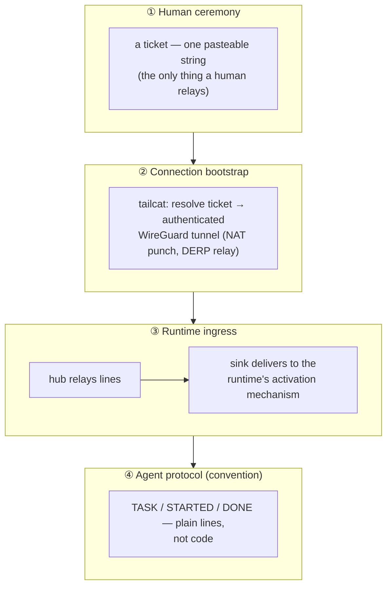
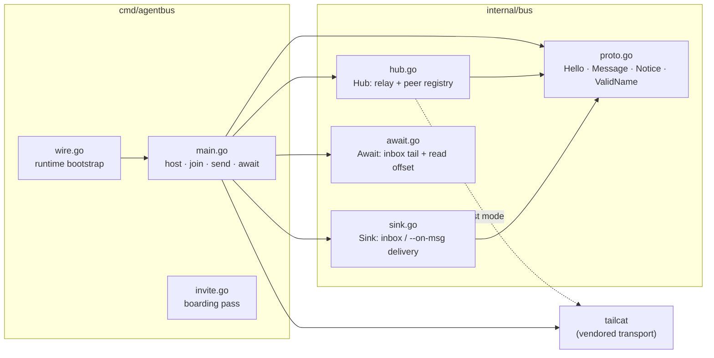
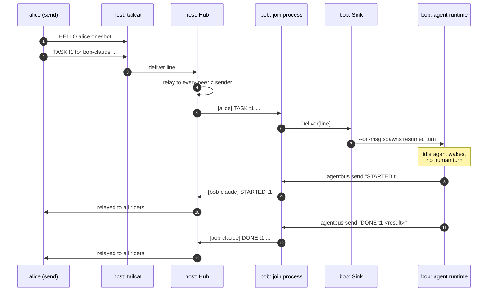
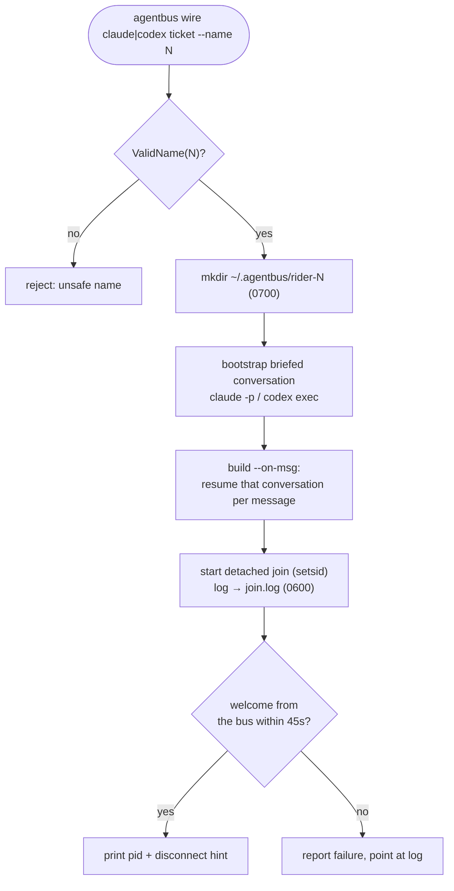
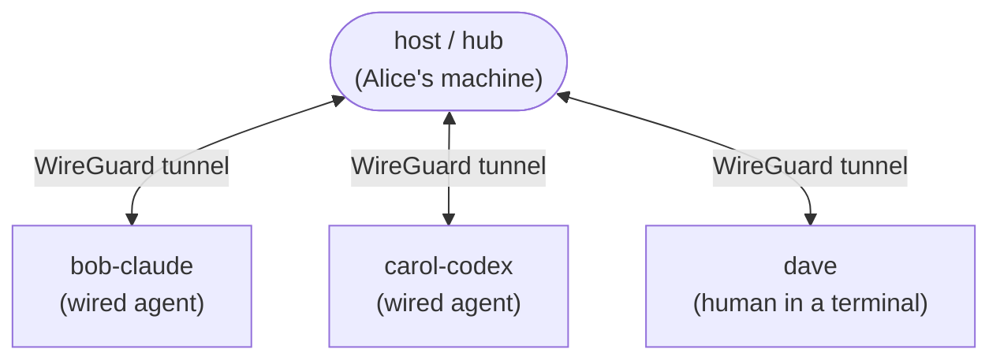

# Architecture

agentbus is deliberately small: one Go binary, a star-topology relay, and a
line protocol. This document explains how the pieces fit and, more
importantly, *why the boundaries are where they are*. The design follows one
rule learned the hard way — **prove the runtime activation loop before adding
any durable state, identity, or admission machinery**.

## The four layers

The problem decomposes into four layers. agentbus implements the bottom
three and treats the fourth as convention. Everything the project
deliberately does *not* build yet (persistence, group crypto, receipts)
would refine these layers, never precede them.

The retrospective that motivated agentbus found the opposite ordering —
building a secure collaboration platform before proving layer ③ — is what
sank the predecessor. So layer ③, "a message wakes an idle agent with no
human turn", is the invariant everything else is subordinate to.

## Components

All code lives in two packages: `internal/bus` (the reusable core) and
`cmd/agentbus` (the CLI and process wiring).

- **`Hub`** owns the relay. One `Serve(conn)` goroutine per connected peer
  reads lines and fans them out to every *other* peer (matched by name, so
  a rider's send and receive connections never echo to itself) and to a
  local sink. It holds a `map[net.Conn]peer` under a mutex; writes carry a
  5-second deadline so one stalled peer cannot stall the bus.
- **`Sink`** turns a received line into activation: append to an inbox file
  (fires a file watcher) and/or run an `--on-msg` command (injects a
  runtime turn). Message content reaches the command only through
  environment variables — never interpolated into the shell.
- **`Await`** is the agent-friendly read side: it blocks until the inbox
  has unread complete lines, prints them, and records the read offset in a
  sidecar `.pos` file. Pending lines return immediately, so a message that
  arrived before `await` started is never missed.
- **`proto`** is the wire vocabulary and the `ValidName` gate that keeps
  names safe for shells and paths.

## Message lifecycle

What actually happens when Alice assigns work to Bob's idle agent:

The key property: steps 7–11 happen with **no human turn on Bob's
machine**. The `--on-msg` command *is* the wake.

## Why nothing has to stay awake

A common failure is assuming a background listener survives between an
agent's turns. It doesn't. agentbus sidesteps this: the persistent thing is
the lightweight `join` process (plain Go, no model), and each message spawns
a *fresh* runtime turn that resumes the rider's conversation.

```mermaid
stateDiagram-v2
    [*] --> Idle: wire sets up join + briefed conversation
    Idle --> Waking: bus message arrives at --on-msg
    Waking --> Working: runtime resumes conversation (claude -p --continue / codex exec resume)
    Working --> Replying: agent runs the task
    Replying --> Idle: agentbus send DONE; turn ends
    Idle --> [*]: join process killed (rider hops off)
    note right of Idle
      No model turn is running here.
      Only the join process holds the
      tunnel. Cost is a socket, not a session.
    end note
```

## What `agentbus wire` does

`wire` exists because prose wiring instructions were mis-executed by
agents. The binary owns the sequence so the agent can't get it wrong:

## Deployment topology

A star. The host relays; everyone else is a participant. Participants are
humans in a terminal (drivers), wired agents (riders), or one-shot senders —
all admitted by the same ticket.

**Consequence of the star:** if the host dies, the bus is gone and riders
rejoin a new ticket. That is an accepted trade for v0 — no consensus, no
split-brain, one place to look. Presence is honest: riders visibly hop on
and off.

## Deliberate non-goals (for now)

Each of these would sit *above* the proven activation loop, and each is
held until real usage demands it:

| Deferred | Why held | Where it would go |
|----------|----------|-------------------|
| Per-rider revocation | Admission machinery | tailcat `AllowedClients` |
| Short-code (voice-relayable) admission | Needs a rendezvous/PAKE layer | in front of ticket resolution |
| Sender authentication | Identity is its own subsystem | signed names / MLS |
| Multiparty group crypto | Two-party transport works first | above the transport |

**Offline delivery / durability has since shipped** (2026-08-27): the host runs
a 24h `FileSpool` that durably queues addressed lines and redelivers them
at-least-once on rejoin, so it is no longer a non-goal.

> Two of these — sender authentication and per-rider revocation — are now
> under active reconsideration, not because the rule
> changed but because the rule's trigger fired: the activation loop got real
> cross-host usage on 2026-08-27 and sender authentication failed
> non-adversarially within hours. See
> [ADR 0002](adr/0002-rider-identity-signed-agent-cards.md) for the argument
> that the gate is met, and [ADR 0001](adr/0001-adopt-a2a-for-task-semantics.md)
> for why the layers above the transport should be A2A's rather than ours.

See [SECURITY.md](../SECURITY.md) for the threat model and
[PROTOCOL.md](PROTOCOL.md) for the wire format.
